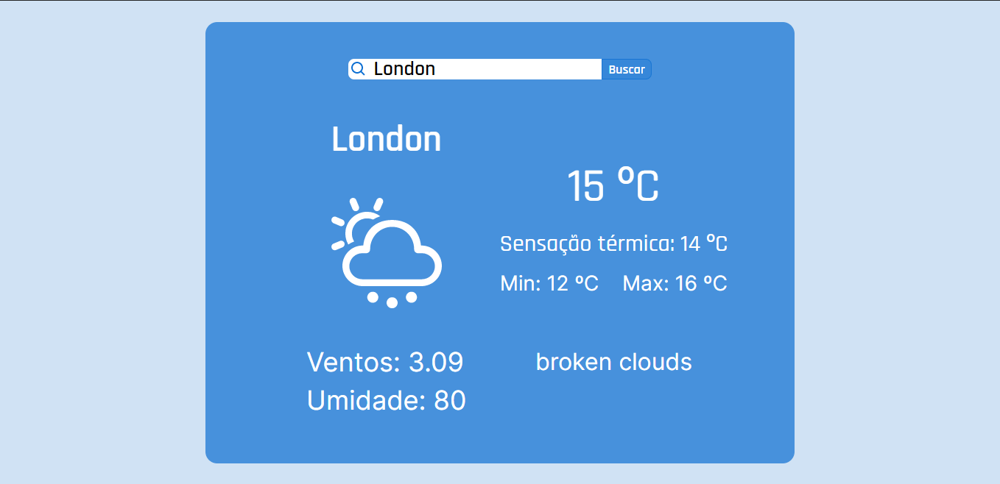
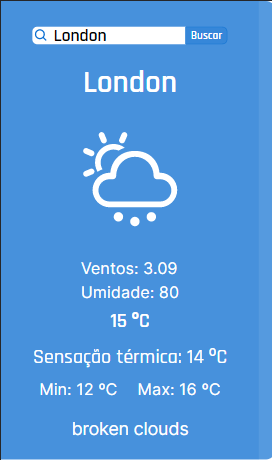

<h1 align="center">Weather Status</h1>
<h2 align="center" >Que tal obter informações climáticas sobre sua cidade?!</h2>
<h3 align="center">Temperatura + infos = API OpenWeather 🌎</h3>

<h4 align="center">➡️<a target="_blank" href="https://weatherstack-six.vercel.app/"> Clique aqui para ir até o site. </a>⬅️</h4>

<h2> 🎬 Tecnologias</h2>

<ul>
  <li><a target="_blank" href="https://reactjs.org/" >React</a> - Código base do projeto.</li>
  <li><a target="_blank" href="https://styled-components.com/" >Styled-components</a> - Masterizar a componetização e estilização no projeto</li>
</ul>

<h2>Visão geral do projeto</h2>

-Web

-Mobile

Alguns dos recursos dessa aplicação:

-   [ ] Modelo responsivo;
-   [ ] Obter informações climáticas sobre muitas cidades;

<h3>Deploy feito na <a href="https://vercel.com/new?utm_source=github&utm_medium=readme&utm_campaign=next-example">Vercel</a> 🖤</h3>

